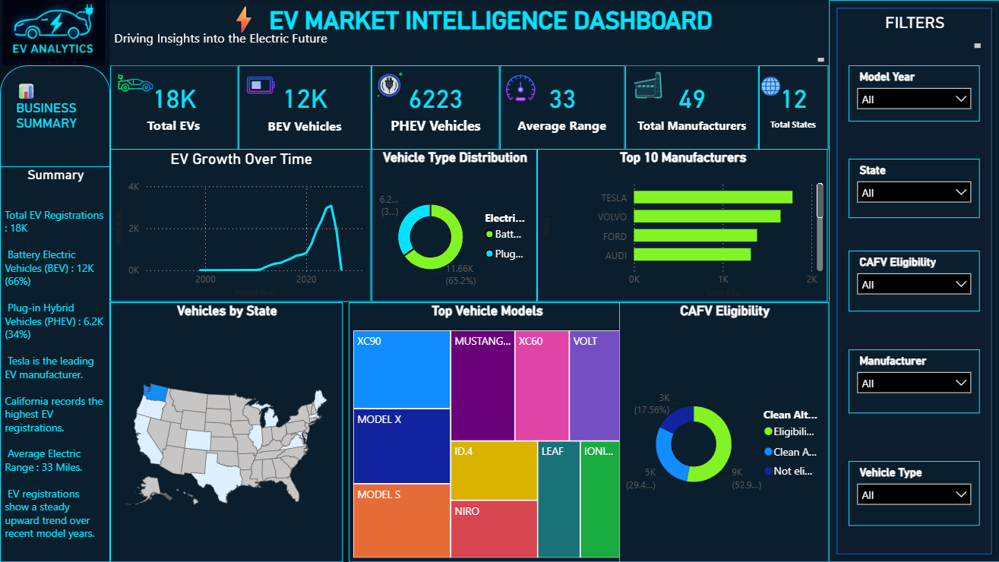

<div align="center">

# EV Market Intelligence Dashboard


</div>

---

## 📖 Project Overview

This project presents an **interactive Power BI dashboard** built to analyze Electric Vehicle (EV) registrations and market trends.

The dashboard converts raw registration data into meaningful business insights through interactive visualizations, KPIs, and filters, enabling users to explore EV adoption, manufacturers, vehicle types, and regional trends.

---

## 📊 Dashboard Preview

<p align="center">

</p>

---

## Features

- Executive KPI Dashboard
- EV Registration Analysis
- Battery Electric Vehicle (BEV) Analysis
- Plug-in Hybrid Electric Vehicle (PHEV) Analysis
- Top Manufacturers
- Top Vehicle Models
- State-wise EV Distribution
- CAFV Eligibility Analysis
- Interactive Filters
- Trend Analysis

---

## Dashboard KPIs

| Metric | Value |
|--------|-------:|
| Total EV Registrations | **18K** |
| Battery Electric Vehicles | **12K** |
| Plug-in Hybrid Vehicles | **6.2K** |
| Average Electric Range | **33 Miles** |
| Manufacturers | **49** |
| States | **12** |

---

## Business Insights

- Battery Electric Vehicles account for approximately **66%** of total registrations.
- Tesla is the leading EV manufacturer.
- California records the highest EV registrations.
- EV adoption has shown consistent growth over recent years.
- Interactive filtering enables detailed exploration by manufacturer, state, model year, vehicle type, and CAFV eligibility.

---

## Tech Stack

| Technology | Purpose |
|------------|---------|
| Microsoft Power BI | Dashboard Development |
| Power Query | Data Cleaning & Transformation |
| DAX | Measures & Calculations |
| CSV Dataset | Data Source |

---

## Dataset

| Attribute | Details |
|-----------|---------|
| Format | CSV |
| Records | 289,565 |
| Domain | Electric Vehicle Registrations |

> **Note:** The original dataset exceeds GitHub's web upload limit and is therefore not included in this repository.

---

## Dashboard Components

- KPI Cards
- Line Chart
- Donut Chart
- Bar Charts
- Map Visualization
- Interactive Slicers
- Business Summary

---

## Repository Structure

```text
EV-Market-Intelligence-Dashboard
│
├── README.md
├── ev_dashboard.pbix
├── ev_dashboard_image.jpeg
└── sample_dataset.csv (optional)
```

---

## Getting Started

1. Clone this repository.
2. Open the `.pbix` file using **Microsoft Power BI Desktop**.
3. Load the dataset if required.
4. Refresh the report.
5. Explore the dashboard using the available filters.

---

## Skills Demonstrated

- Data Visualization
- Business Intelligence
- Dashboard Design
- Power BI
- DAX
- Power Query
- Data Cleaning
- KPI Development
- Analytical Thinking

---

## Future Improvements

- Real-time data integration
- Forecasting using Power BI
- Additional KPI measures
- Mobile-optimized dashboard
- Power BI Service deployment

---

## Author

### Santhosh C

B.Tech – Computer Science & Software Engineering  
REVA University

**GitHub**  
https://github.com/Santhosh-271121

**LinkedIn**  
https://www.linkedin.com/in/santhosh-c-19a766335

---

<div align="center">

### ⭐ If you found this project useful, consider giving it a star.

**Turning Data into Actionable Insights with Power BI**

</div>
